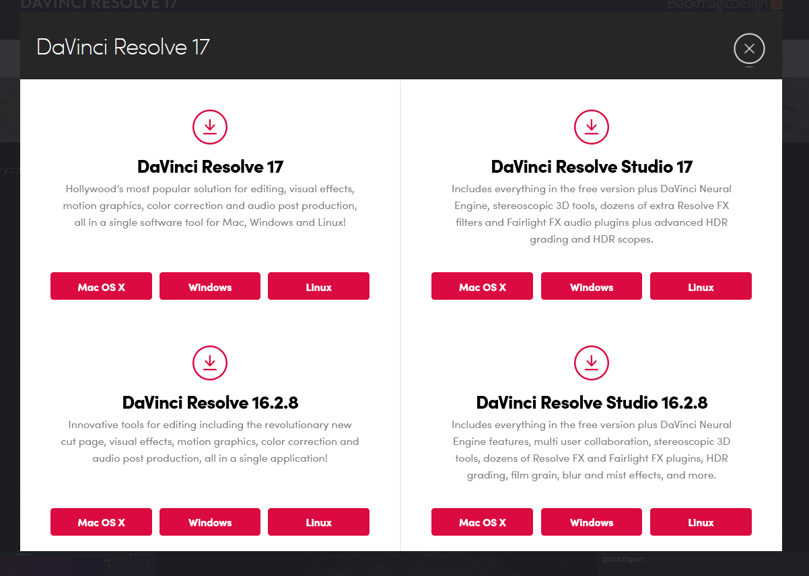

# Videoschnittprogramm installieren
Zunächst solltest du dir überlegen 

## Das Programm: Davinci Resolve
Die Titel-Vorlagen sind für Davinci Resolve erstellt worden, daher bietet sich es an, auch dieses Schnittprogramm zu benutzen. Natürlich kannst du auch ein anderes Programm benutzen, kannst damit allerdings die Templates benutzen.

Davinci Resolve ist gratis und - sofern man erweiterte Optionen ausblendet - recht einfach zu lernen.

## Herunterladen
Davinci Resolve (im Folgenden nur noch "Resolve") bekommst du hier:

[Resolve herunterladen](https://www.blackmagicdesign.com/products/davinciresolve/){: .btn .btn-purple }

Keine Sorge, wenn du von der Seite irritiert bist: Nein, wir schneiden keine Kinofilme, Resolve ist auch für kleine Projekte gut. 😉

### Die richtige Version auswählen
Es gibt eine Bezahl-Version von Resolve, aber die Gratis-Version reicht uns massig. Aktuell heißt die Bezahl-Version "DaVinci Resolve Studio", also "DaVinci Resolve" (ohne Studio) auswählen. Außerdem kann man manchmal noch die alte Version herunterladen. Normalerweise sollte die Neueste gut funktionieren.

Bei folgendem Popup also die Version links oben für dein Betriebssystem auswählen:

### Download starten
Leider wirst du nach deinen Daten gefragt, bevor du das Programm herunterladen kannst. Glücklicherweise werden diese nicht überprüft, du kannst also irgendwas eintragen. Danach kannst du Resolve herunterladen.

## Installieren
Nachdem das Programm heruntergeladen hat, kannst du es installieren. Normalerweise kommt Resolve mit einigen Zusatzprogrammen, die wir aber alle nicht brauchen. Deshalb, wenn du auswählen kannst, die Checkboxen wie folgt setzen:

(Screenshot für Windows, macOS müsste ähnlich sein)

Dann ganz normal installieren.