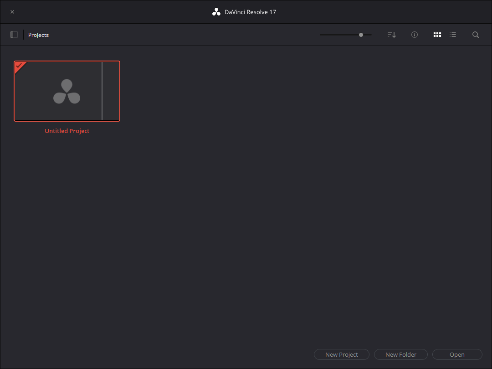
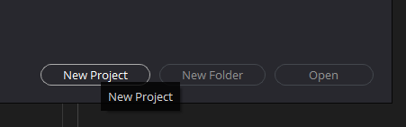
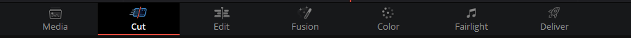
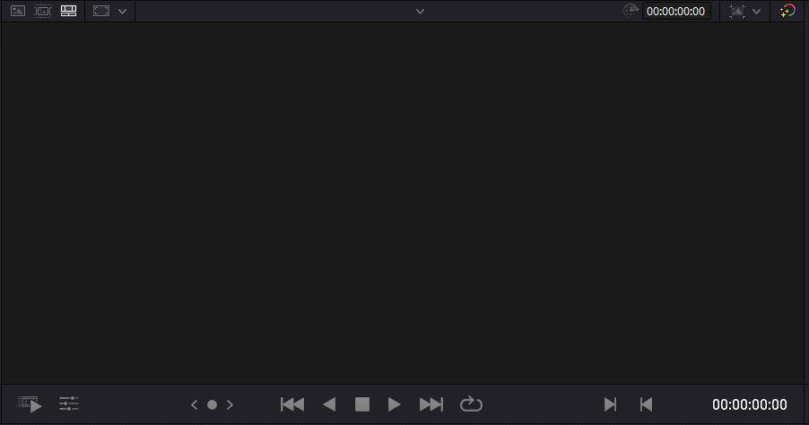
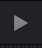
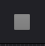
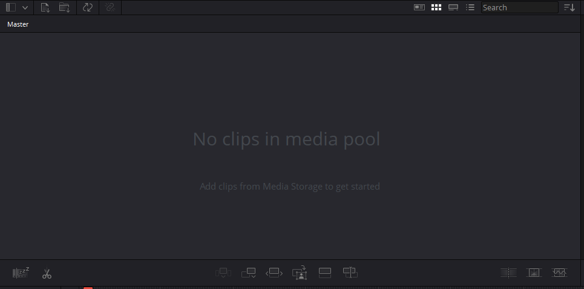
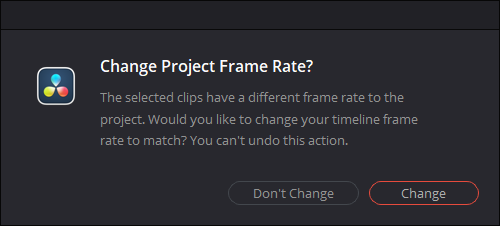
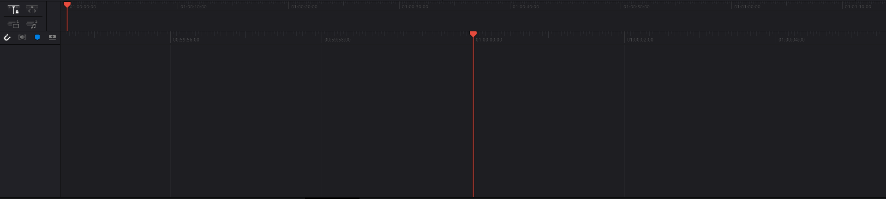

# Übersicht über Resolve
{: .no_toc }
Resolve ist eine recht umfangreiche Software, aber sobald du dir einen Überblick verschafft hast, ist sie recht übersichtlich.

## Inhalt
{: .no_toc .text-delta }

1. TOC
{:toc}

## Der Projekt-Manager
Das erste, was du nach dem Laden-Bildschirm zu sehen bekommst, ist der Projekt-Manager. Hier werden alle deine Videos, die du schneiden wirst, angezeigt.

Erstelle zu Demo-Zwecken einfach mal ein leeres Projekt und öffne es.

## Die Tabs

Wenn du ein Projekt offen hast, siehst du untem am Bildschirm eine Leiste mit verschiedenen Tabs. Für uns sind eigentlich nur der Schnitt-Tab ("Cut"), und der Export-Tab ("Deliver") wichtig. Wenn das nicht schon der Fall ist, gehe auf den Schnitt-Tab.

## Der Schnitt-Tab ("Cut")
Hier findet der Hauptteil deiner Arbeit statt. Der Bildschirm ist ein mehrere Abschnitte eingeteilt: In der unteren Hälfte siehst du die Timeline. Links drüber ist der Media-Pool und rechts davon das Vorschau-Fenster.

### Das Vorschau-Fenster

Bisher ist das Vorschau-Fenster ("Viewer") leer, während dem Schneiden zeigt es einfach eine Vorschau von dem, wie dein Video am Ende sein wird.

Wichtig im Viewer sind vor allem die zwei Buttons Play  und Stop , um das Video laufen zu lassen und zu stoppen.

### Media-Pool

Der Media-Pool enthält alle Videos (und andere Elemente), die du für dein Projekt brauchst. Um Videos hinzuzufügen, öffne sie per Rechtsklick auf die leere Fläche > "Medien importieren" ("Import Media"). Wähle dann die entsprechenden Dateien aus.

Manchmal wirst du dann gefragt, ob du die Projekt-Framerate ändern willst.

In der Regel solltest du sie nicht ändern.

### Die Timeline

